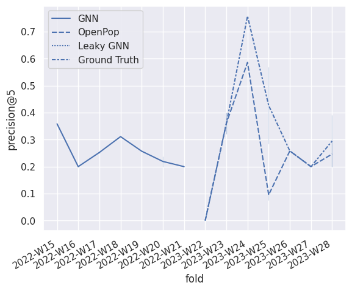
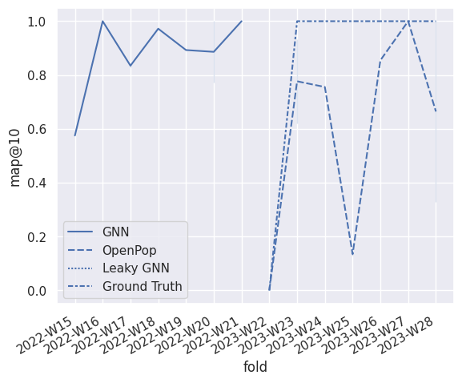

# Enhancing Voter Engagement in Decentralized Governance: A Recommender System for DAOs using Graph Neural Networks

This repository contains the official implementation of [Enhancing Voter Engagement in Decentralized Governance: A Recommender System for DAOs using Graph Neural Networks][doi]

## Citing

You can cite our paper:
> David Davó and Javier Arroyo. 2024. Enhancing Voter Engagement in Decentralized Governance: A Recommender System for DAOs using Graph Neural Networks. In Proceedings of 18th ACM Conference on Recommender Systems (RecSys ’24). ACM, New York, NY, USA, 8 pages. [https://doi.org/XXXXXXX.XXXXXXX][doi]

## Requirements

To install requirements, just install this package:
```
pip install -e .
```

To execute the notebooks, you might need to install the optional dependencies:

```
pip instell -e .[notebooks]
```

## Training

Run the [run_all.ipynb](./notebooks/run_all.ipynb) notebook. It will take multiple hours or days depending on the system.
You might want to modify some parameters in the notebooks that use a GPU.

To see the progress, you can open the notebooks in the folder [./nbout/](./nbout/). You might want to use [Jupyter Lab RTC](https://jupyterlab.readthedocs.io/en/stable/user/rtc.html), as it will automatically reload the notebook when there are changes on the disk.

### Training artifacts (pre-trained models)

You can find the pre-trained models (ray tune artifacts) on Zenodo:

- Davó, D. (2024). Training Artifacts of A Recommender System for DAOs using GNN. Zenodo. https://doi.org/10.5281/zenodo.11061988

You'll need to unzip all the folders into `$HOME/ray_results`, and you can find an example of usage in [12_analyze_results.ipynb](./notebooks/12_analyze_results.ipynb)


## Evaluation

Run the [12_analyze_results.ipynb](./notebooks/12_analyze_results.ipynb) notebook

## Results

> **Caution**: Our model uses a custom dataset with a personalized evaluation methodology, which is detailed on the paper.

| precision@5 in folds | map@10 in folds |
|----------------------|-----------------|
|  |  |

<table>
  <thead>
    <tr style="text-align: right;">
      <th>rec</th>
      <th>metric</th>
      <th>mean</th>
      <th>std</th>
      <th>median</th>
      <th>min</th>
      <th>max</th>
    </tr>
  </thead>
  <tbody>
    <tr>
      <th rowspan="2" valign="top">baseline</th>
      <th>map@10</th>
      <td>0.310075</td>
      <td>0.070509</td>
      <td>0.304259</td>
      <td>0.212009</td>
      <td>0.417010</td>
    </tr>
    <tr>
      <th>precision@5</th>
      <td>0.221133</td>
      <td>0.036484</td>
      <td>0.225931</td>
      <td>0.175100</td>
      <td>0.287129</td>
    </tr>
    <tr>
      <th rowspan="2" valign="top">oracle</th>
      <th>map@10</th>
      <td>0.474460</td>
      <td>0.084692</td>
      <td>0.487608</td>
      <td>0.344509</td>
      <td>0.599718</td>
    </tr>
    <tr>
      <th>precision@5</th>
      <td>0.305215</td>
      <td>0.037089</td>
      <td>0.293243</td>
      <td>0.253815</td>
      <td>0.349153</td>
    </tr>
    <tr>
      <th rowspan="2" valign="top">realistic</th>
      <th>map@10</th>
      <td>0.365456</td>
      <td>0.084257</td>
      <td>0.362174</td>
      <td>0.265038</td>
      <td>0.490331</td>
    </tr>
    <tr>
      <th>precision@5</th>
      <td>0.263800</td>
      <td>0.049743</td>
      <td>0.269822</td>
      <td>0.185915</td>
      <td>0.333898</td>
    </tr>
  </tbody>
</table>

## Acknowledgments


This work was supported by the Spanish Ministry of Science and Innovation under Grant PID2021-127956OB-I00 (Project DAO Applications).

[doi]: https://doi.org/XXXXXXX.XXXXXXX
