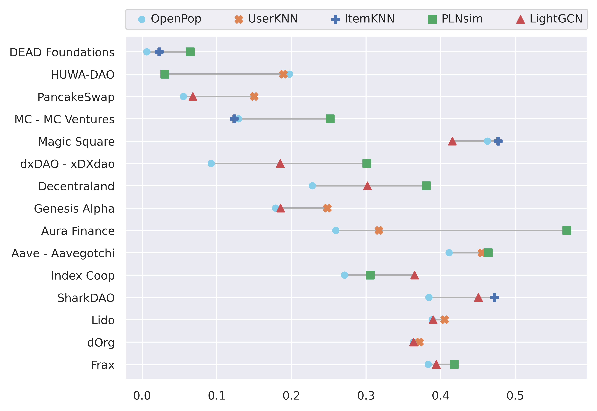
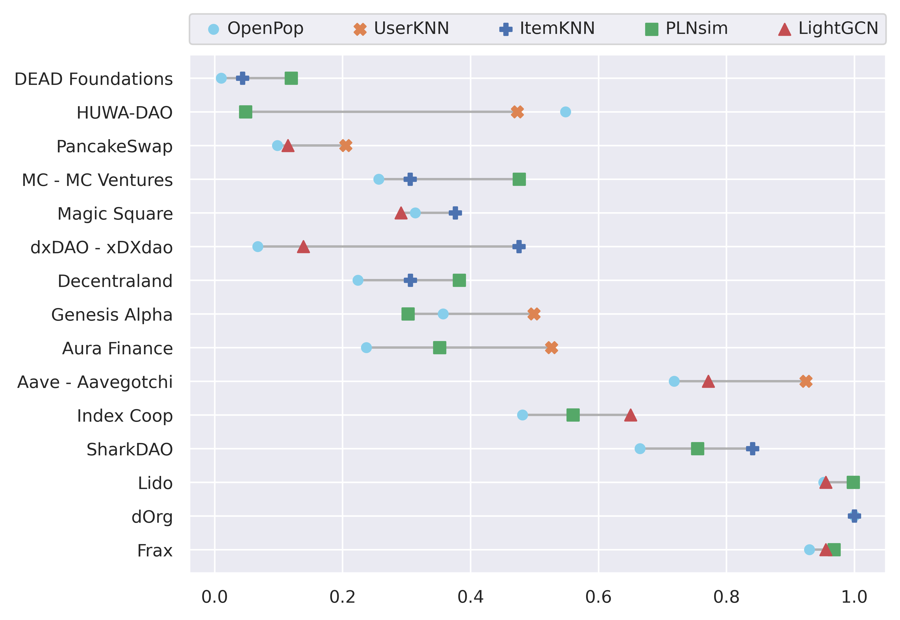

# Enhancing Voter Engagement in Decentralized Governance: Exploring Recommender Systems for Decentralized Autonomous Organizations

This repository contains the official implementation of [Enhancing Voter Engagement in Decentralized Governance: Exploring Recommender Systems for Decentralized Autonomous Organizations][doi]

## Citing

You can cite our paper:
> David Davó and Javier Arroyo. 2024. Enhancing Voter Engagement in Decentralized Governance: Exploring Recommender Systems for Decentralized Autonomous Organizations. **To be published**. [https://doi.org/XXXXXXX.XXXXXXX][doi]

## Requirements

To install requirements, just install this package:
```
pip install -e .
```

To execute the notebooks, you might need to install the optional dependencies:

```
pip instell -e .[notebooks]
```

## Training

Run the [run_all.ipynb](./notebooks/run_all.ipynb) notebook. It will take multiple hours or days depending on the system.
You might want to modify some parameters in the notebooks that use a GPU.

To see the progress, you can open the notebooks in the folder [./nbout/](./nbout/). You might want to use [Jupyter Lab RTC](https://jupyterlab.readthedocs.io/en/stable/user/rtc.html), as it will automatically reload the notebook when there are changes on the disk.

## Evaluation

Run the [90_results.ipynb](./notebooks/90_results.ipynb) notebook

## Results

| precision@3 | recall@3 |
|----------------------|-----------------|
|  |  |

| map@100 | r-precision@100 |
|----------------------|-----------------|
|  |  |

## Acknowledgments


This work was supported by the Spanish Ministry of Science and Innovation under Grant PID2021-127956OB-I00 (Project DAO Applications).

Part of this work was done as David Davó's Master's Thesis: _[Exploración de sistemas recomendadores para la recomendación de propuestas en organizaciones autónomas descentralizadas](https://oa.upm.es/82151/)_

[doi]: https://doi.org/XXXXXXX.XXXXXXX
